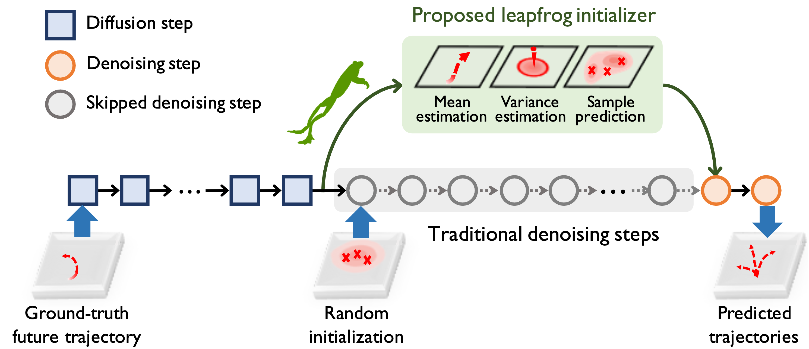

# EE260 Final Project: Diffusion-based Trajectory Prediction for Vulnerable Road Users (VRUs)

Modified from [Leapfrog Diffusion Model for Stochastic Trajectory Prediction (LED)](https://github.com/MediaBrain-SJTU/LED).

## 1. Overview

<div align="center">  
  
</div>

**Abstract**: With the development of diffusion models, more and more interesting scenarios are proposed, e.g., image generation. Diffusion models are generative models which can generate new data similar to the data they were trained on. Some researchers have considered generating trajectories using diffusion models. Our motivation is the rising attention on the safety issue of Vulnerable Road User (VRU). VRU trajectory prediction at the intersection is essential for the safety of safe-driving cars and should be further considered. Thus, this final project aims to use a diffusion-based model, LEapfrog Diffusion Model for Stochastic Trajectory Prediction (LED) to predict trajectories of VRU at the intersection scenario, explore the effects of traffic signals on the performance of the model, and compare the model’s performance with different VRU objects. It is observed that Modified LED can generate satisfactory trajectories, and that the trajectories of fast-speed objects are more impacted by the traffic signal. 

## 2. Code Guidance

Overall project structure:
```text
----LED_Modified\   
    |----README.md
    |----requirements.txt # packages to install                    
    |----main_led_nba.py  # [CORE] main file
    |----trainer\ # [CORE] main training files, we define the denoising process HERE!
    |    |----train_led_trajectory_augment_input.py 
    |----models\  # [CORE] define models under this file
    |    |----model_led_initializer.py                    
    |    |----model_diffusion.py    
    |    |----layers.py
    |----utils\ 
    |    |----utils.py 
    |    |----config.py
    |----data\ # preprocessed data and dataloader
    |    |----files\ # NBA and preprocessed SinD data
    |    |----dataloader_nba.py
    |    |----data_process.py # process SinD data
    |----cfg\ # config files
    |    |----nba\
    |    |    |----led_augment.yml
    |----results\ # store the results and checkpoints
    |    |----checkpoints\
    |    |----fig\ #visualization results
    |    |----led_augment\
    |----visualization\ # some visualization codes
    |    |----data\ #visualization data
    |    |----draw_mean_variance.ipynb
    |----SinD
    |    |----README.md
    |    |----Format.md
    |    |----doc
    |    |    |----File-Directory.md
    |    |    |----...
    |    |----SIND-Vis-tool
    |    |    |----utils
    |    |    |    |----DataReader.py
    |    |    |    |----dict_utils.py
    |    |    |    |----map_vis_lanelet2.py
    |    |    |    |----map_vis_without_lanelet.py 
    |    |    |----VisMain.py
    |    |    |----intersection_visualizer.py
    |    |    |----requirements.txt
    |    |    |----README.md
    |    |----Data
    |    |    |----[recording_day_n] 
    |    |    |    |----Ped_smoothed_tracks.csv
    |    |    |    |----Ped_tracks_meta.csv
    |    |    |    |----TraficLight_[recording_day_n].csv
    |    |    |    |----Veh_smoothed_tracks.csv
    |    |    |    |----Veh_tracks_meta.csv
    |    |    |    |----recoding_metas.csv
    |    |    |    |----mapfile.osm

```

You can download the data and results [here](https://drive.google.com/drive/folders/1ZuOMe68CXrIMK_z_HebsMCIv8FJuzPW4). 

### 2.1. Environment
We train and evaluate our model on `Ubuntu=22.04` with `RTX 3090-24G`.

Create a new python environment (`led`) using `conda`:
```
conda create -n led python=3.7
conda activate led
```

Install required packages using Command 1 or 2:
```bash
# Command 1 (recommend):
pip install -r requirements.txt

# Command 2:
pip install torch==1.8.0+cu111 torchvision==0.9.0+cu111 torchaudio==0.8.0 -f https://download.pytorch.org/whl/torch_stable.html
pip install easydict
pip install glob2
```

### 2.2. Training

You can use the following command to start training the initializer.
```bash
python main_led_nba.py --cfg <-config_file_name_here-> --gpu <-gpu_index_here-> --train 1 --info <-experiment_information_here->

# e.g.
python main_led_nba.py --cfg led_augment --gpu 0 --train 1 --info try1
```

And the results are stored under the `./results` folder.

### 2.3. Evaluation

We provide pretrained models under the `./checkpoints` folder, both trained on NBA and SinD dataset.

**Reproduce**. Using the command `python main_led_nba.py --cfg led_augment --gpu 0 --train 0 --info reproduce` and you will get the following results:
```text
(191888, 30, 35, 4)
(191888, 30, 35, 4)
500
(47972, 30, 35, 4)
(47972, 30, 35, 4)
100
[Core Denoising Model] Trainable/Total: 6568720/6568720
[Initialization Model] Trainable/Total: 4634997/4634997
./results/led_augment/New_diff_SinD_train_100epoch_withoutlight_t2/models/model_0100.p
--ADE(1s): 0.0284	--FDE(1s): 0.0255
--ADE(2s): 0.0333	--FDE(2s): 0.0371
--ADE(3s): 0.0395	--FDE(3s): 0.0485
--ADE(4s): 0.0471	--FDE(4s): 0.0720
```

### 2.4. Datasets
We use SinD dataset to retrain the emhanced LED model, then evaluate it.

So far, we have extracted the data of pedestrian, bicycle, tricycle and motorcycle from SinD and saved them as SinD_7_train_light_p.npy, SinD_5_train_light_b.npy, SinD_20_train_light_t.npy, SinD_3_train_light_m.npy.

You can load the .npy data in the dataloader_nba.py. 

The processed data format is aligned with NBA dataset, which contains 11 agents' continuous 30-frames-length trajectories in a period of time. 

For the SinD dataset, we have to add blank data into the .npy, because the number of the agents in one frame is fluctuating. The number of the agents will be the largest appeared one during the recorded peroid.

### 2.5. Modifications
#### 2.5.1 Traffic Light Signal
Add Acceleration and Traffic Light Signals to the input feature layers.

Code need to be modified during running:

```text
trainer/train_led_trajectory_augment_input.py
models/model_led_initializer.py
models/layers.py
models/model_diffusion.py
```

Find #changing the mode, with or without light and acceleration. 

#### 2.5.2 Attention Module
Add a Squeeze-and-Excitation Module to self enhance the important features.

Code need to be modified during running:

```text
models/model_led_initializer.py
```

Line 25: #turn on or off the ResNet and SE module. 

#### 2.5.3 SinD Dataset Visualization
Add a python program to import and visualize the sind data set to make it easy to observe.

Create a new python environment (`SinD`) using `conda`:
```
conda create -n SinD python=3.8
conda activate SinD
```

cd into /LED_Modified/SinD/SIND-Vis-tool/ then install required packages:
```
pip install -r requirements.txt
```

To visualize the data run 
```
python VisMain.py <data_path (../LED_Modified/data/SinD/)> <record_name (7_28_1)> from this folder directory to visualize the recorded data.
```

In the visualization, traffic participants (vehicles and pedestrians) are presented as rectangular boxes. By clicking a rectangular box with the mouse, multiple graphs showing the changes of the parameters corresponding to the motion state of the traffic participants can pop up. 

## 3. Acknowledgement

Most code is borrowed from [SinD](https://github.com/SOTIF-AVLab/SinD) , [LED](https://github.com/MediaBrain-SJTU/LED), [MID](https://github.com/Gutianpei/MID), [NPSN](https://github.com/InhwanBae/NPSN) and [GroupNet](https://github.com/MediaBrain-SJTU/GroupNet). 

We thank the authors for releasing their code.
